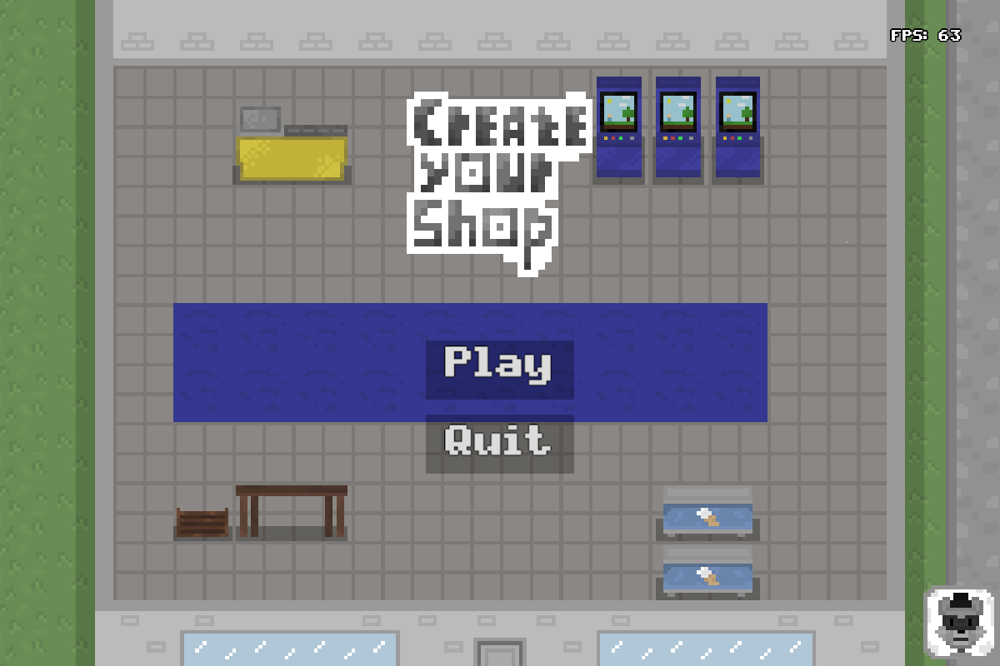
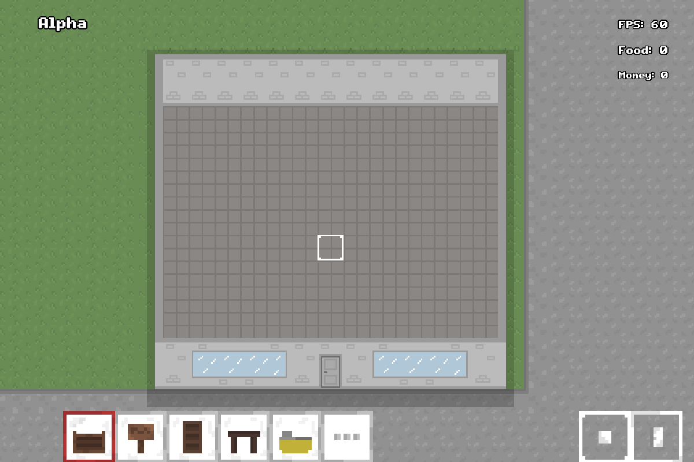

<h1 align="center">Create your Shop (CYS)</h1>

  

  
  

  <strong>✨ Game where you have to set up your own shop ✨</strong>
  <small> 
    Hello everyone this is my first 2d game that i made using wgpu api. 
    For now it is my favorite project. I use winit for window and wgpu for rendering graphics. 
    The game is in Alpha stage. 
  </small>

  <strong>Update history:</strong>
  <small> 
  "Hello, world" Update - This is first update where i added basic gameplay. 
  "Map" Update - This is Big map update. 
  "Adventure" Update - This is big items update (not finished). 
  ... 
  </small>

<h2>Controls</h2>

<table>
  <tr><th>Key</th><th>Action</th></tr>
  <tr><td><kbd>LMB</kbd></td><td>Place / remove object</td></tr>
  <tr><td><kbd>Scroll</kbd></td><td>Zoom</td></tr>
  <tr><td><kbd>1</kbd>–<kbd>0</kbd></td><td>Select slot</td></tr>
  <tr><td><kbd>Q</kbd></td><td>Rotate object</td></tr>
  <tr><td><kbd>Space</kbd></td><td>Toggle store open/closed</td></tr>
  <tr><td><kbd>E</kbd></td><td>Open inventory</td></tr>
  <tr><td><kbd>Esc</kbd></td><td>Settings</td></tr>
  <tr><td><kbd>Ctrl+S</kbd></td><td>Save game</td></tr>
  <tr><td><kbd>Ctrl+L</kbd></td><td>Load game</td></tr>
</table>

<h2>Architecture</h2>

<pre>
src/
├── main.rs              — App, render loop, event handling
├── constants.rs         — All game constants
├── data/                — Slot/Object definitions, placement logic
├── map/                 — Map loading & pathfinding
├── npc/                 — Shopper NPC logic
├── ecs/                 — ECS adapter, components, factory, group
├── input/               — Camera, cursor, interaction
├── scene/               — Menu, Game scene, scene manager
├── ui/                  — HUD, settings, text renderer
├── inventory.rs         — Inventory system
└── util.rs              — Helper utilities
</pre>