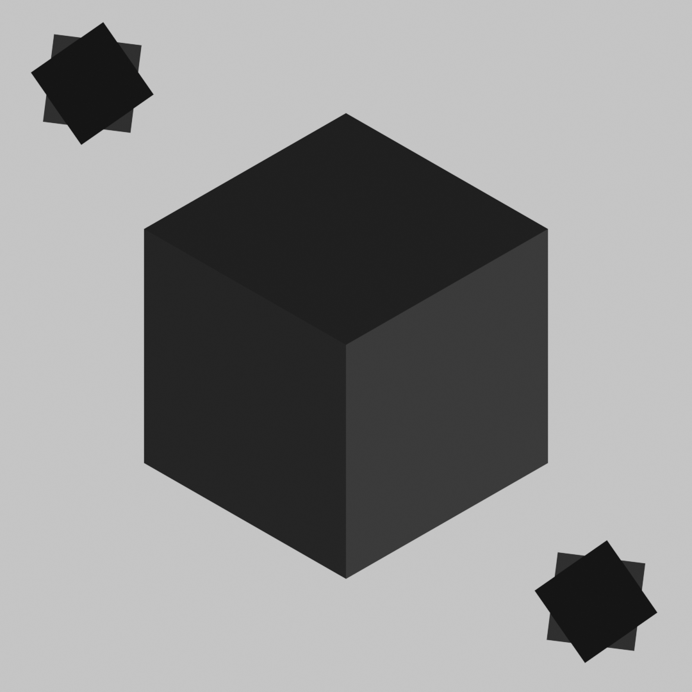
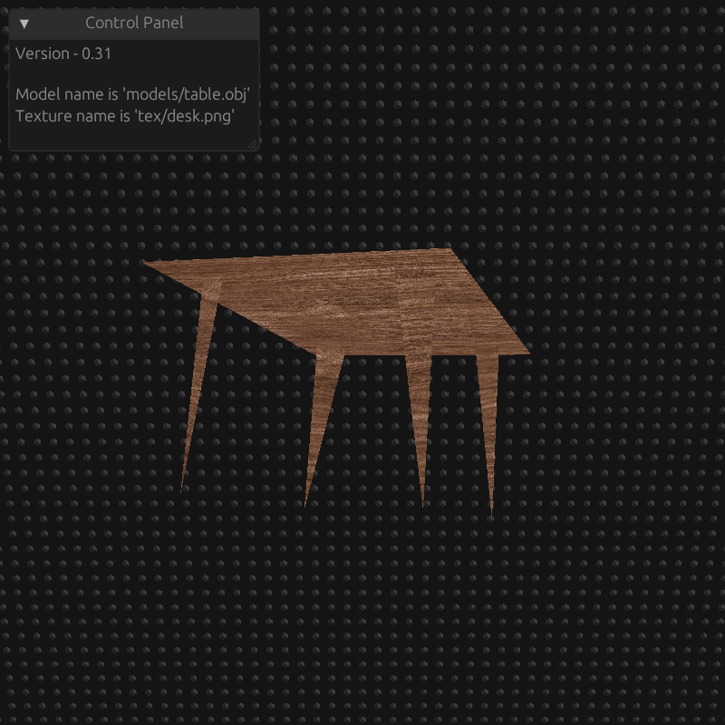

# 3D model view (TMV) Alpha

<p align="center">
  
  
</p>

```bash
#install program
git clone https://github.com/EnotCoder/game_wgpu.git
cd wgpu

#run program
cargo run -- ./file.obj ./texture.png
```
